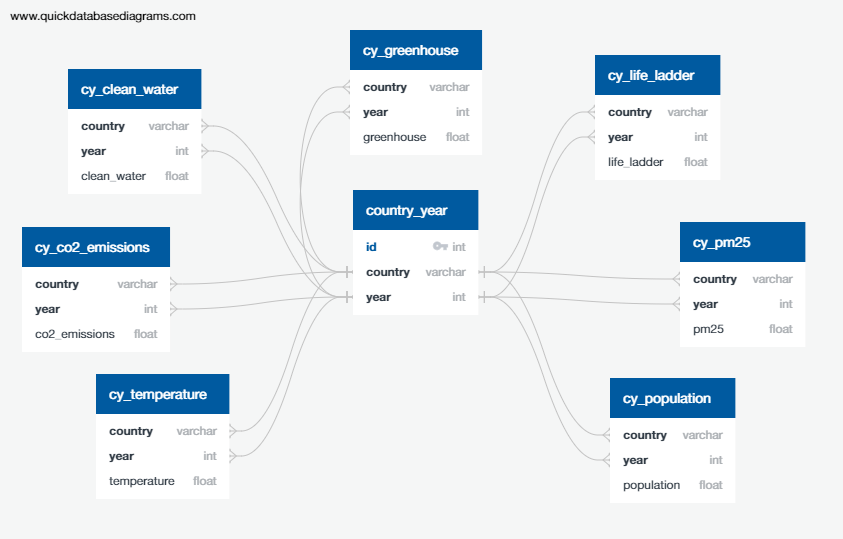

# Final Project - Environmental Factors and Effects on Human Well-Being and Happiness

## Overview

This is the repository for Module 20, the ***Final Project***, of the University of Toronto Data Analysis Bootcamp Course. Work created and organized by Akinsola Salami, Jeffrey Au, Suleiman Barekzai, Najeeb Amlani, and Shaun Coulter.

## Communication Protocols

We communicated as a team with the following methods:

* Google Doc Organization
  * Google Drive File Share
* Dedicated Slack Channel Discussions
* Google Meet Meetings
  * Outside of Class Discussions

We currently plan to do our analysis with the use of the following tools (more tools will be added as needed):

* **Python**
  * Pandas
  * NumPy
  * TensorFlow
  * scikit-learn
  * Matplotlib
* **SQL**
  * PostgreSQL
  * pgAdmin
* Tableau

We may use the following tools - ideas are still being investigated.

## Folder Structure Detailed

* **Dataset** - our current main datasets, the standard one, and one that has been corrected by the population of the country (per capita).
* **Notebooks/Machine Learning** - currently 4 examples of a machine learning model to predict the Life Ladder value from environmental data (expanded on below).
* **Resources** - datasets that we transformed and cleaned for main dataset.
* **SQL_Database** - files pertaining to the PostgreSQL/pgAdmin database, including a Schema and Queries, as well as the files that we import to the database (more detal below).
* **Visualizations** - maps made with the machine learning models and Tableau.

## Our Data Story

We are setting out to look at how the environment around us affects how happy we are, and how strong this effect is. We will do this by looking at the environmental variables of countries, and seeing if we can use them to predict the `Life Ladder` target variable from the **World Happiness Index**.

Is the environment a major source of the quality of life for humanity? Or is it merely a small part of a much larger story?

## Independent Variables

* Country Name
* Year of Pertaining Data
* Average Temperature
* Percentage Access to Clean Water
* Greenhouse Gas Emissions
* Air Quality - PM2.5
* CO<sub>2</sub> Emissions
* Population

For the per capita dataset we removed the Population variable, but used it to produce the variables:

* Greenhouse Gas Emissions per Capita
* CO<sub>2</sub> Emissions per Capita

## Dependent Variable

Our dependent variable will be the Life Ladder value in the World Happiness Index. In this index the value is produced from the measurements of the other categories which include:

* Log GDP per Capita
* Social Support
* Healthy Life Expectancy at Birth
* Freedom to Make Life Choices
* Generosity
* Perceptions of Corruption
* Positive Affect
* Negative Affect

This dataset was taken from Kaggle and can be found by [clicking here](https://www.kaggle.com/ajaypalsinghlo/world-happiness-report-2021?select=world-happiness-report.csv).

## Presentation and Visualizations

Using Tableau tools along with data wrangling, we will produce visualizations detailing the variables we found and plot them on maps. This will give us a way to look for correlation amongst the independent variables, while also allowing a user to find interesting information of their own. We will also include the target variables to see if we can visually show our overarching data story. These maps, along with any required graphs will be contained on an interactive dashboard for all to use.

[Google Slides Presentation](https://docs.google.com/presentation/d/16L31giLhW9ze0KgWcnrd5dRoYOU0Yt9biegWROOU-Q4/edit?usp=sharing)

## Database

After cleaning the datasets with Python we imported them into our designed PostgreSQL database in pgAdmin. To do this we created an ERD (shown below) and a schema to describe the database setup.



More information about the cleaning of data, and the datasets themselves can be found in the `sql_database` folder. We also include a number of queries we have used for data analysis, for example, creating our main dataset using `JOIN`'s:

```sql
-- Create the main table through multiple joins.
-- Include unique ID.
SELECT row_number() OVER () AS id,
		cw.country,
		cw.year,
		cw.clean_water,
		co2.co2_emissions,
		gg.greenhouse,
		ll.life_ladder,
		pm.pm25,
		pop.population,
		temps.temperature
INTO main_joined_table
FROM cy_clean_water AS cw
LEFT JOIN cy_co2_emissions AS co2
	ON cw.country = co2.country AND cw.year = co2.year
LEFT JOIN cy_greenhouse AS gg
	ON cw.country = gg.country AND cw.year = gg.year
LEFT JOIN cy_life_ladder AS ll
	ON cw.country = ll.country AND cw.year = ll.year
LEFT JOIN cy_pm25 AS pm
	ON cw.country = pm.country AND cw.year = pm.year
LEFT JOIN cy_population AS pop
	ON cw.country = pop.country AND cw.year = pop.year
LEFT JOIN cy_temperature AS temps
	ON cw.country = temps.country AND cw.year = temps.year;
  ```

## Machine Learning

Our goal in the Machine Learning aspect of this project is to **use environmental variables about countries from the last 10 or so years to train a model that predicts their corresponding life ladder values**. We gather the above environmental variables for each country, for each year, and pass each instance of year and country into the model to train it. This model will then predict the life ladder values for other years in the dataset, as well as potentially predicting future scores. We also explore KMeans clustering as a way to look for patterns in the data. More details below.

In the machine learning notebooks we use `SQLAlchemy` to connect to our PostgreSQL database and pull the data from it, rather than loading a CSV file. More information about this process can be found in the following notebooks.

Below is a list describing in detail the makeup of the `notebooks/machine_learning` folder, and the analysis we have performed so far.

* `ML - Keras TensorFlow Modelling of Life Ladder to Predict 2018` - [here](notebooks/machine_learning/ML%20-%20Keras%20TensorFlow%20Modelling%20of%20Life%20Ladder%20to%20Predict%202018.ipynb) - in this notebook we follow the ETL method, starting with extracting the data from an SQL database that was designed by us. We do this by using `SQLAlchemy` and `automap_base()`, reflecting the tables in the database to a variable we create. We transform the data by dropping any rows with null values, and the unneeded `ID` column. We use `OneHotEncoder` to encode the categorical data of the Country names, and then drop the `Country` column so we are only left with numerical data. We split the data into non-2018 training data and 2018 testing data to train and test the model on, where the features are the environmental columns, and the target is the `Life Ladder` value. We create a `Scaler` instance and train it with the training data, fitting it to both the training and testing data. We create our model, a neural network built with the Keras package from TensorFlow, with an input layer and one hidden layer. We use the `mean_absolute_error` loss metric for produce predictions for the `Life Ladder` values. We then use the model to predict the `Life Ladder` values for the countries for 2018, and evaluate it with various graphs and metrics, while also saving the output for further analysis if needed.
* `ML - KMeans Clustering Analysis of Dataset` - [here](notebooks/machine_learning/ML%20-%20KMeans%20Clustering%20Analysis%20of%20Dataset.ipynb) - in this notebook we explore KMeans clustering by again providing the dataset from the SQL database, removing the null rows and unneeded columns. We then split the data into each year, and loop through it creating a new KMeans model each time to make clusters for each year for the set of countries. We use 4 clusters as that seemed to return the best analysis when we did earlier versions of this modelling. The data is scaled and transformed as in the Neural Network analysis. We store the classes for each country into a new table for each year and export it for further visualization use - Tableau.
* `saved_models` - contains the save file from the neural network creation.
* `predictions` - contains the various predicted results from the different machine learning models.
* `segment1/` and `segment2` - the analysis that led up to our more polished machine learning models.

## Data Sources

Our complete list of data sources are:

* https://www.kaggle.com/berkeleyearth/climate-change-earth-surface-temperature-data?select=GlobalLandTemperaturesByCountry.csv
* https://www.kaggle.com/adityakadiwal/water-potability
* https://www.kaggle.com/sevgisarac/temperature-change
* https://www.kaggle.com/natashalondon/climate-change-where-we-are-and-what-we-can-do?select=CO2+emissions+by+energy+source+World+1990-2017+-+Africa.csv
* https://www.kaggle.com/ajaypalsinghlo/world-happiness-report-2021?select=world-happiness-report.csv
* https://data.worldbank.org/indicator/EN.ATM.GHGT.KT.CE
* http://berkeleyearth.lbl.gov/country-list/
* https://ourworldindata.org/co2-and-other-greenhouse-gas-emissions
* https://www.who.int/data/gho/data/indicators/indicator-details/GHO/concentrations-of-fine-particulate-matter-(pm2-5)
* https://www.who.int/data/gho/data/indicators/indicator-details/GHO/population-using-at-least-basic-drinking-water-services-(-)

## Link to Dashboard Story
[Link to Dashboard Storyboard on Google Slides](https://docs.google.com/presentation/d/1GU2uN5hGSZcJhtLaCoZDoFTNrHmEsVjjUldqkSYuPU0/edit#slide=id.p).

## Tableau Links
[Tableau Link 1](https://public.tableau.com/app/profile/akinsola.salami/viz/UpdatedClimateandWellBeing/Sheet5).

[Tableau Link 2](https://public.tableau.com/app/profile/jeffrey.au7418/viz/FinalProjectmock/ChangesinPopulation2010-2018?publish=yes).

[Tableau Link 3](https://public.tableau.com/app/profile/akinsola.salami/viz/ClimateandWellBeing/PopulationofEachCountry).

[Tableau Link 4](https://public.tableau.com/app/profile/suleiman.barekzai/viz/Top5CountrieswithHighestEmissions/HighestEmissionsbyCountry?publish=yes).

[Tableau Link 5](https://public.tableau.com/app/profile/najeeb6870/viz/FinalProjectVisualizations-Najeeb/Dashboard1?publish=yes).


## Project Commentary

* 21-07-04 - UoT Final Project Repo - Shaun Coulter, Akinsola Salami, Jeffrey Au, Najeeb Amlani, and Suleiman Barekzai.
* 21-07-04 - Branches created for each member. Data discussion and project outline created.
* 21-07-07 - After class discussion gave us a more concrete goal, we will data collect and reconvene after Thursday's class.
* 21-07-11 - Discussion before Segment 1 submission, organized file structure for future merges.
* 21-07-22 - Added new machine learning files, as well as SQL database information - need to add further visualizations and Tableau links.
* 21-07-29 - Finalized README, combined different Tableau sheets, planned for presentation.

Link to [Google Doc](https://docs.google.com/document/d/1EW4t8kRGlLc9MQogQzHVajHzpL0GueukDG4ZbumZaHs/edit).
