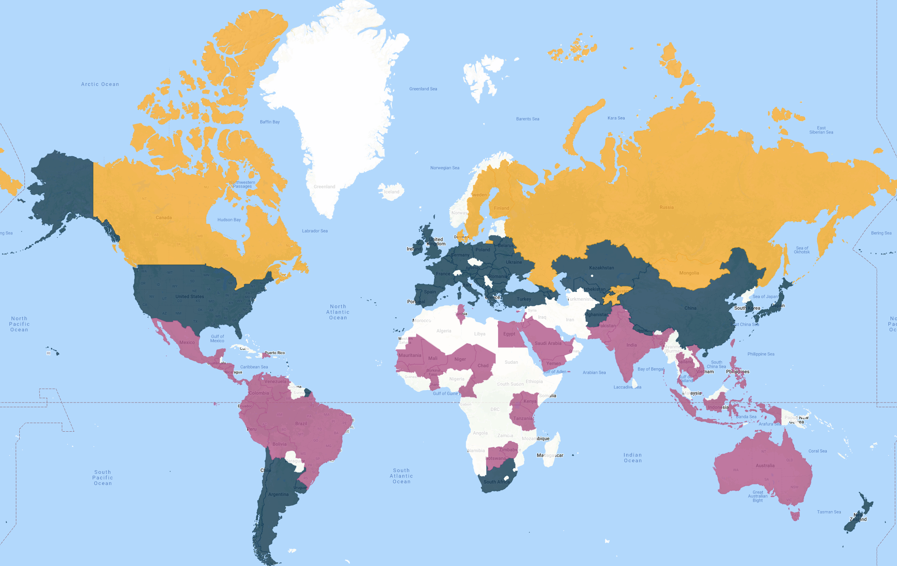
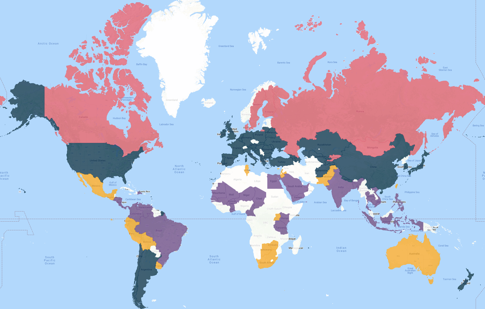

# Final Project - Climate Change and Effects on Human Well-Being (Quality of Life)

## Work in this Branch

* `11_add_clean_water.ipynb` - read in the cleaned data from Suleiman's branch and add it as a column to the reordered dataset - `M_country_happ_temp_water.csv`.
* `10_alternate_table_layout.ipynb` - reorder the main dataset to create a dataset with two indexes, `Country` and `Year`, and then have two columns, `Life Ladder` and `Temperature`.
* `09_happiness_ml_kmeans.ipynb` - perform **KMeans** cluster analysis on the country's happiness values (Life Ladder), and plot the resulting maps.

***KMeans Clustering with 3 Clusters for Happiness Values:***

***KMeans Clustering with 4 Clusters for Happiness Values:***

* `08_temperature_ml_kmeans_plotting.ipynb` - plot the cluster analysis on a map using `gmaps`, create interactive webpages and save the images (see below).

***KMeans Clustering with 3 Clusters for Temperature Values:***

***KMeans Clustering with 4 Clusters for Temperature Values:***

* `07_temperature_ml_kmeans.ipynb` - do some more data cleaning, and perform **KMeans cluster analysis** on the country's temperatures, using 3 and 4 clusters.
* `06_make_full_temp_ds.ipynb` - using the scraped temperature data and the analysed happiness dataset, combine altogether to make one main dataset: `MAIN_countries_happiness_temps_full.csv`
* `05_be_temp_analysis.ipynb` - parse the scraped text files to generate CSV files of every countries temperature history - will be very useful for visualizations.
* `04_berkeley_temperature_data_pull.ipynb` - scrape the Berkeley Earth webpage to pull temperature data for every country in the finalized countries list.
* `03_happiness_report_analysis.ipynb` - notebook reads in the Happiness Report and performs analysis to reduce country list down to just those with data points from 2010-2019, as well as 2021, and exports the table to a CSV file.
* `02_air_quality_api_pull.ipynb` - notebook was intended to be used to pull historical air quality data from OpenWeatherMap API, however this API only goes back to 2020, not many years as required.
* `01_qol_ratings_scrape.ipynb` - notebook scrapes QoL table at Numbeo.com - we aren't using this resource though.
